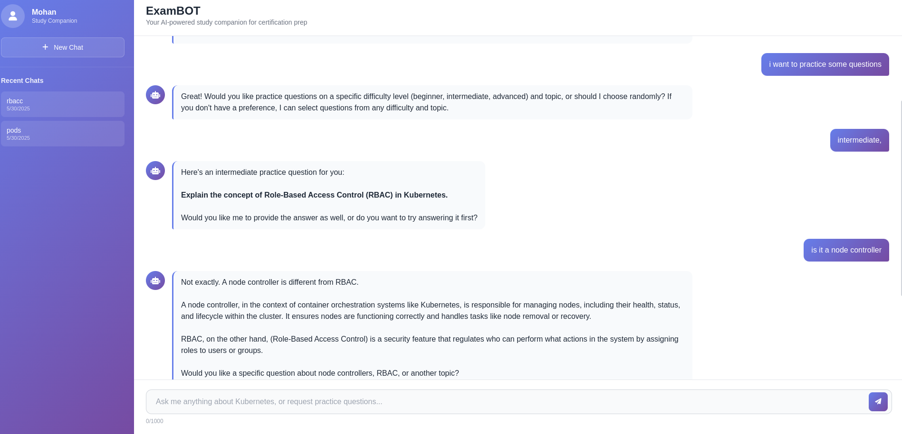

# 🧠 Exam-BOT (MCP-Based AI Agent for LF Certificate Prep)

A prototype AI agent built using the **Model Context Protocol (MCP)** to assist students preparing for **Linux Foundation (LF) certifications** through interactive practice questions and intelligent Q&A responses.

---

Here is the demo video of bot in action: 
https://www.loom.com/share/e11263ab6c3e4a4da33e5e2b726cfd80?sid=173cf35a-8447-4666-b374-a78f5c5193d4
## 🚀 Project Overview

This project serves as an intelligent study companion leveraging **open-source Large Language Models (LLMs)** and **MCP servers** to provide an engaging and interactive learning experience. The agent supports:

- Random practice questions
- Semantic search of relevant Q&A pairs
- Guided conversation for deeper understanding

---

ScreenShots of the bot in action


---

For this ExamPrep Agent we have created two datasets:
- **Kubernetes-Q&A** - A collection of Q&A pairs focused on Kubernetes and cloud native concepts. It is uploaded to my hugging face id. 
here is the link to the dataset. https://huggingface.co/datasets/ItshMoh/kubernetes_qa_pairs . It contains 497 Q&A pairs. It has also crossed **45 downloads** on hugging face.
It is made for KCNA exam. Contents are taken from the kubernetes.io licensed under CC BY 4.0

- **Metal-mining-Q&A** - A collection of Q&A pairs focused on metal mining methods. The link to the dataset https://huggingface.co/datasets/ItshMoh/metal-mining-qa-pairs . It has also more than 31 downloads on hugging face.
## 🏗️ Architecture

### 🔧 Key Files Description

#### Core Application Files

`app.py`

`app.py`: Direct API integration architecture

- Communicates directly with LLM APIs (OpenAI-compatible)
- Manages MCP server subprocess internally
- Suitable for direct API deployments


#### LLM Integration Files


`llm_api.py` - FastAPI Integration (Direct)

- HTTP API endpoint integration
- Subprocess MCP server management
- Audio message processing
- Session-based context handling


#### MCP & Database

`main.py` - MCP Server
- Implements FastMCP server
- Provides get_random_question() and get_question_and_answer() tools
- Interfaces with TiDB for full-text search
The system is composed of several core components:

`database/tidb.py` - TiDB Integration

- Vector similarity search
- Full-text search capabilities
- Q&A pair management
- Bulk data operations

---

## 🛠️ Setup Scripts

### Setting up the .env file

The `.env` file should contain some important environment variables. You can copy the template from the `.env.example` file and fill in the required values.

### Setting up the TiDB dataset 

```
bash setup_dataset.sh
```

### Running the MCP Server
```
python3 main.py
```

Purpose: Complete system initialization
#### What it does:
- starts the MCP server 

#### Start the BOT:
```
python3 app.py
```
---
## Getting Started with the project

1. **Clone the repository:** 
```
https://github.com/cardea-mcp/ExamPrepAgent.git
```

2. **Install dependencies:** 
```
pip install -r requirements.txt
```
`NOTE` If you get any dependency conflict while installing fastmcp. Try to first uninstall it and then install it manually by 
```
pip install fastmcp
```
3. The `.env` file should contain some important environment variables. You can copy the template from the `.env.example` file and fill in the required values.

4. **Setting up the TiDB dataset:**
```
bash setup_dataset.sh
```

5. **Start the MCP server:** 
```
python3 main.py
```

6. Start the app
```
python3 app.py
```
## ✨ Features

### Core Workflows

#### 📌 Workflow 1: Question Search
1. User asks a specific question.
2. LLM invokes the `get_question_and_answer()` MCP function.
3. The system searches the TiDB for relevant Q&A pairs.
4. The LLM provides a contextual, helpful response based on the findings.

#### 🎯 Workflow 2: Practice Mode
1. User requests a practice question.
2. LLM invokes the `get_random_question()` MCP function.
3. The system returns a random Q&A pair.
4. The LLM presents the question and guides the user's learning.

---

## 🛠️ Technical Stack

- **Python 3.x**
- **FastMCP** – MCP server framework
- **TiDB** – SQL database for Full text Search 
- **JSON** – Data storage format

---
## 📁 Project Structure
```

    Directory structure:
└── Exam-BOT
    ├── README.md
    ├── app.py
    ├── app_nexus.py
    ├── install_tts_features.sh
    ├── install_voice_features.sh
    ├── llm.py
    ├── llm_api.py
    ├── llm_api_nexus.py
    ├── main.py
    ├── register_apis.sh
    ├── requirements.txt
    ├── rust_qa.txt
    ├── setup_complete_system.sh
    ├── setup_mcp_server.sh
    ├── start_llama_nexus.sh
    ├── start_system.sh
    ├── start_tidb_mcp.sh
    ├── audio_processing/
    │   ├── audio_utils.py
    │   ├── tts_handler.py
    │   └── whisper_handler.py
    ├── database/
    │   ├── csv_loader.py
    │   ├── dataloader.py
    │   ├── monogodb.py
    │   └── tidb.py
    ├── dataset/
    │   ├── dataPrep.py
    │   ├── file.json
    │   ├── kubernetes_basic.json
    │   ├── kubernetes_qa.csv
    │   ├── mining_qa_pairs.csv
    │   ├── playwright_scrap.py
    │   ├── url_data_fit.py
    │   └── url_scrap.py
    ├── encoder/
    │   └── encoder.py
    ├── static/
    │   ├── audio_recorder.js
    │   ├── index.html
    │   ├── script.js
    │   ├── styles.css
    │   └── uploads/
    │       └── .gitkeep
    ├── utils/
    │   ├── data.py
    │   └── ques_select.py
    └── vectorstore/
        └── qdrant.py

   
```
---
## 🔧 MCP Functions

## 🔮 Future Enhancements

 
- **Expanded Datasets**: Add more LF certification topics  
- **Advanced Analytics**: Track learning progress and weak areas  
- **Multi-modal Support**: Include diagrams and visual aids  
---

### Kubernetes Dataset

The dataset has been created using the [kubernetes.io](https://kubernetes.io) documentation. It is available under CC BY 4.0. license. 

Here is the link to the [dataset](https://huggingface.co/datasets/ItshMoh/kubernetes_qa_pairs)

The dataset has been generated using this [script](https://github.com/cardea-mcp/ExamPrepAgent/blob/master/url_scrap.py)

## 🤝 Contributing

1. Fork the repository  
2. Create your feature branch:  
   ```bash
   git checkout -b feature/amazing-feature
   ```
3. Add your Q&A datasets in the specified format
4. Test your changes with the MCP server
5. Submit a pull request.
---

